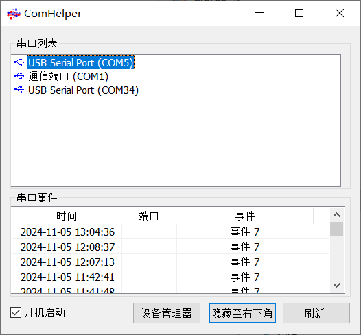
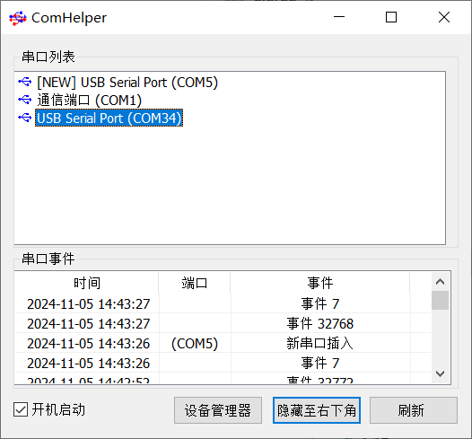

# [happyttl] 一个让电子工程师感到开心的TTL
> 
> 当插入一个USB转TTL最头痛的就是这个TTL的串口是什么？又要打开设备管理器一个一个地查找？
> 有时多了，根本也不知道是哪一个，又要重新插拔一次！
> 现在可以通过本项目提供的上位机，很简单地找到当前新插入的USBTTL是哪一个端口，同时本软件还提供了一个右下角的通知，这样甚至不需要打开这个软件，只要开机启动就可以了。 
> 搭配补充的硬件，可以实现一个USB转2*TTL，2个TTL同时可以显示串口号（需要上位机支持）用起来更是方便 :D。
>

## 上位机软件
上位机软件基本界面

当有新的USB转TTL插入时会有NEW字眼 

并且有一个插入拔出通知

## 支持
